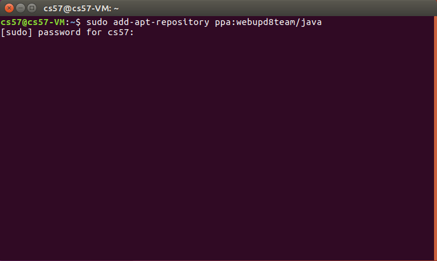
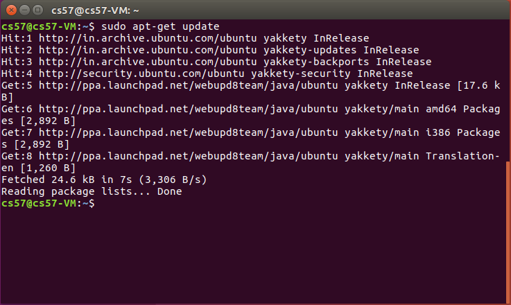
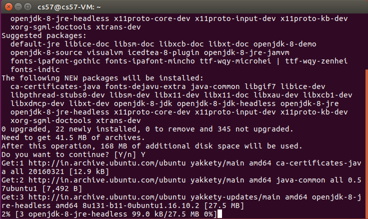
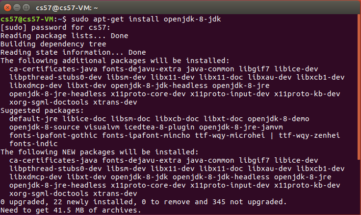
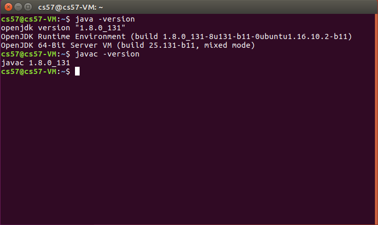
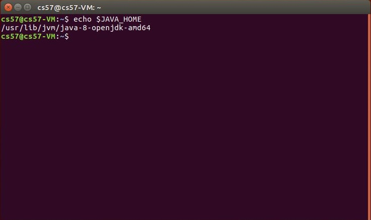

# How to Install Java (JRE/JDK) on Ubuntu 16.10: A Beginner's Guide from an Installation Expert

Hello there! As your installation expert, I'm here to guide you through installing Java on your Ubuntu 16.10 system. Whether you just want to run Java applications or you're dreaming of becoming a Java developer, this guide will make the process clear and straightforward. We'll explore two common ways to get Java onto your machine.

---

## Understanding Java: JRE vs. JDK – What's the Difference?

Before we start typing commands, let's clear up some fundamental concepts about Java that often confuse beginners:

* **JRE (Java Runtime Environment): Your Java Application Runner**
    * **Think of it like:** The engine and fuel for a car.
    * **Purpose:** If your goal is simply to *use* programs or applications that were built using Java (like a specific desktop tool, a game, or a web application that runs on your computer), then the JRE is what you need. It allows these Java programs to run.
    * **What it contains:** The JRE includes the **Java Virtual Machine (JVM)**, which is the magic component that executes Java code, along with a set of core **Java Class Libraries** that provide basic functionalities.

* **JDK (Java Development Kit): Your Java Developer's Toolkit**
    * **Think of it like:** The entire car factory, including the engine and fuel components.
    * **Purpose:** If you aspire to *create*, *write*, *compile*, and *debug* your own Java programs, then you definitely need the JDK. This is the complete package for Java software development.
    * **What it contains:** The JDK is a **superset of the JRE**. This means it has *everything* the JRE has (the JVM and core libraries), *plus* essential development tools. Key tools include:
        * `javac`: The Java compiler, which translates your human-readable Java code into bytecode that the JVM can understand.
        * `javadoc`: For generating documentation from your code.
        * `jar`: For packaging Java applications.
        * And many more utilities vital for a developer.
    * **Key takeaway:** If you install the JDK, you automatically get the JRE functionalities. So, if you're developing, you don't need to install JRE separately!

---

## Prerequisites: Getting Ready for Installation

Before we begin, please ensure you have the following in place:

* **Oracle VirtualBox (Optional but Common):** If you're following this tutorial within a virtual machine, make sure your VirtualBox environment is already set up and your Ubuntu 16.10 guest operating system is running smoothly. This is a common and safe way to experiment with installations without affecting your main computer.
* **Ubuntu 16.10:** This guide is specifically designed for Ubuntu version 16.10. While many commands are similar across Ubuntu versions, there can be subtle differences. If you're on a different version, some steps might require minor adjustments.
* **Active Internet Connection:** You'll need a stable internet connection to download software packages from Ubuntu's online repositories.
* **Terminal Access:** We'll be using the command-line interface, known as the "Terminal." You can easily open it by pressing the `Ctrl + Alt + T` keys on your keyboard simultaneously. This is where you'll type and execute all the commands.

---

## Method 1: Installing the Default JRE/JDK (OpenJDK)

This is usually the simplest and most recommended method for most users. OpenJDK is an open-source implementation of Java, fully compatible with standard Java, and readily available directly from Ubuntu's software repositories.

### Step 1: Update Your System's Package List

It's always a best practice to refresh your system's package information *before* installing new software. This ensures that your system knows about the latest versions of all available packages and their dependencies.

1.  **Open Terminal:** If you haven't already, press `Ctrl + Alt + T` to launch your Terminal.
2.  **Run the update command:**
    ```bash
    $ sudo apt-get update
    ```
    * `sudo`: This stands for "**S**uper**U**ser **DO**". It grants you temporary administrative (root) privileges to execute commands that modify system files or install software. When you type `sudo`, the system will ask for your user password. Type it carefully (you won't see anything appearing on the screen as you type, not even asterisks) and then press `Enter`.
    * `apt-get update`: This command connects to Ubuntu's configured software repositories (online servers) and downloads the latest "lists" of available packages. It **does not install or upgrade** any software itself; it just updates the index of what's available.

### Step 2: Install Java (Choose JRE or JDK)

Now that your package list is up-to-date, you can proceed with installing either the JRE or the JDK.

#### Option A: Install JRE (Java Runtime Environment) – If you only need to run Java programs

If your primary need is to simply run existing Java applications (e.g., a software tool, a game written in Java), this is the command for you.

```bash
$ sudo apt-get install default-jre
```
* `apt-get install`: This command is used to download and install specified software packages onto your system.
* `default-jre`: This is the name of the package containing the default (OpenJDK) Java Runtime Environment.
* During the installation, you'll likely see a summary of the packages that will be installed and the amount of disk space they will consume. You'll be prompted with `[Y/n]` to confirm. Type `Y` (for Yes) and press `Enter` to proceed.


#### Option B: Install JDK (Java Development Kit) – If you plan to develop Java programs

If you're an aspiring Java developer or need to compile Java code, you should install the default JDK. **Remember: JDK includes JRE, so installing JDK covers both development and running capabilities.** You don't need to install JRE separately if you install JDK.

```bash
$ sudo apt-get install default-jdk
```
* `default-jdk`: This is the package name for the default (OpenJDK) Java Development Kit.
* Again, you'll be prompted to confirm the installation. Type `Y` and press `Enter`.

---

## Method 2: Installing Oracle Java 8 on Ubuntu 16.10 via PPA (For Specific Requirements)

Sometimes, specific older applications or legacy development environments might explicitly require Oracle's proprietary version of Java, even though OpenJDK is generally preferred. This method shows you how to install Oracle Java 8 using a PPA (Personal Package Archive).

**A Quick Word of Caution:** Oracle Java 8 is an older release. For new projects, I (as your installation expert) would generally recommend using newer Long-Term Support (LTS) versions of OpenJDK (like OpenJDK 11 or 17) for better performance, security, and modern features. Only proceed with Oracle Java 8 if you have a clear requirement for it.

### Step 1: Add the PPA Repository to Your System

A PPA is a special software repository maintained by individuals or teams that contains software not always found in the main Ubuntu repositories, or newer versions of software.

1.  **Open Terminal:** Make sure your Terminal is open (`Ctrl + Alt + T`).
2.  **Add the PPA:** Execute the following command to add the `webupd8team/java` PPA, which is well-known for providing Oracle Java packages for Ubuntu.
    ```bash
    $ sudo add-apt-repository ppa:webupd8team/java
    ```
    * `add-apt-repository`: This command is designed to easily add new software repositories to your system's `sources.list`.
    * `ppa:webupd8team/java`: This is the unique identifier for the specific PPA we're adding.
    * After running this command, you'll likely see some information about the PPA and be asked to press `Enter` to confirm adding it. Go ahead and press `Enter`.



### Step 2: Update Your Package List (Again!)

Whenever you add a new software repository, it's crucial to update your system's package list again. This tells your system to look in the newly added PPA for available packages.

```bash
$ sudo apt-get update
```
* This command will now re-scan all your configured repositories, including the `webupd8team/java` PPA, and fetch the package information from them.


<!--  -->

### Step 3: Install Oracle Java 8 JDK

Now that the PPA is added and your package lists are updated, you can install Oracle Java 8.

```bash
$ sudo apt-get install openjdk-8-jdk
```
* `openjdk-8-jdk`: This specific package will handle the download and installation of Oracle Java 8 from the PPA.
* **Crucial Step: Accepting the Oracle License Agreement!** During this installation, you will most likely encounter a screen presenting the **Oracle Binary Code License Agreement for Java SE**. You **must** accept this license to proceed.
    * Use your keyboard's **arrow keys** to navigate through the text.
    * Press the **`Tab` key** to move the cursor between options like `<Ok>` or `<Cancel>`.
    * Once `<Ok>` is highlighted (or the option to accept), press `Enter`. You might need to do this twice: once to acknowledge the agreement and once to accept it.



### Step 4: Set Oracle Java 8 as Default (Optional but Recommended if using multiple Java versions)

If you happen to have multiple Java versions installed on your system (e.g., you installed OpenJDK earlier, and now Oracle Java 8), you can configure your system to primarily use Oracle Java 8.

```bash
$ sudo apt-get install oracle-java8-set-default
```
* This command installs a small helper package that correctly sets up your system's alternatives, ensuring that when you type `java` or `javac`, it points to your Oracle Java 8 installation.

---

## Verify Your Java Installation: Let's Check!

After going through the installation steps, it's always a good idea to confirm that everything worked as expected.

### Step 1: Check Your Java Runtime Environment (JRE) Version

This command will tell you which version of the Java Runtime Environment is currently active and ready to run Java programs.

1.  **Run the command:**
    ```bash
    $ java -version
    ```
2.  **Expected Output:**
    * If you installed **OpenJDK**, you'll see output similar to this (the exact build number might vary, but notice "OpenJDK"):
        ```
        openjdk version "1.8.0_312"
        OpenJDK Runtime Environment (build 1.8.0_312-8u312-b07-0ubuntu1~16.04)
        OpenJDK 64-Bit Server VM (build 25.312-b07, mixed mode)
        ```
    * If you installed **Oracle Java 8**, the output will look something like this (notice "Java(TM) SE Runtime Environment"):
        ```
        java version "1.8.0_311"
        Java(TM) SE Runtime Environment (build 1.8.0_311-b11)
        Java HotSpot(TM) 64-Bit Server VM (build 25.311-b11, mixed mode)
        ```

### Step 2: Check Your Java Compiler (JDK) Version

If you installed the full JDK (either `default-jdk` or `oracle-java8-installer`), you can verify the compiler component.

1.  **Run the command:**
    ```bash
    $ javac -version
    ```
2.  **Expected Output:**
    * For **OpenJDK**:
        ```
        javac 1.8.0_312
        ```
    * For **Oracle Java 8**:
        ```
        javac 1.8.0_311
        ```
    * **Important:** If you *only* installed the JRE (not the JDK), running `javac -version` will likely result in a "command not found" error. This is perfectly normal because the JRE does not include the compiler.



### Step 3: View the JAVA_HOME Environment Variable (Optional, for advanced users or specific apps)

The `JAVA_HOME` environment variable is a common setting that many Java-based applications, build tools (like Apache Maven or Gradle), and development environments use to find where your Java Development Kit is installed.

1.  **Run the command:**
    ```bash
    $ echo $JAVA_HOME
    ```
2.  **Expected Output:**
    * This command will print the path to your Java installation if the `JAVA_HOME` variable is set. It might look something like `/usr/lib/jvm/java-8-openjdk-amd64` or `/usr/lib/jvm/java-8-oracle`.
    * **What if it's empty?** If this command returns a blank line or no output, it means the `JAVA_HOME` variable is not currently set in your shell's environment. This is quite common with `default-jdk` installations. It doesn't necessarily mean your Java isn't working for basic commands, but some advanced applications might require you to set it manually. For Oracle Java installed via PPA, it is often set automatically.




---

That's it! As your installation expert, I can confidently say you've now successfully installed Java on your Ubuntu 16.10 system. You're ready to run Java applications or embark on your journey as a Java developer!