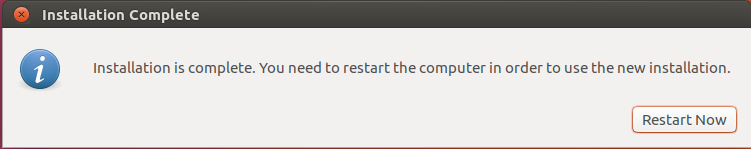
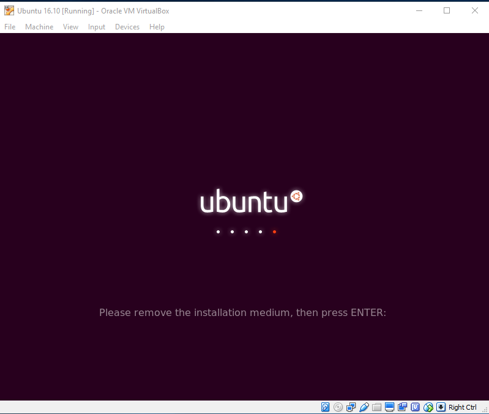

# How to Install Ubuntu on a Virtual Machine: A Step-by-Step Guide for Beginners

This guide will walk you through the process of installing Ubuntu on a Virtual Machine using VirtualBox. We'll go into detail for each step to make sure you understand everything clearly, even if you're a fresher in the world of virtualization.

---

## Prerequisites: What You'll Need

Before we begin, ensure you have the following essential components:

* **VirtualBox:** This is the software that allows you to create and run virtual machines on your existing computer (your "host" machine). Think of it as a virtual computer within your real computer.
* **VirtualBox Guest Additions:** While not strictly required for installation, these are highly recommended for an optimal experience. Once installed inside your virtual machine (after Ubuntu is set up), Guest Additions provide crucial enhancements like:
    * **Mouse Pointer Integration:** Your mouse will seamlessly move between your host computer and the virtual machine without needing to press a special key.
    * **Shared Clipboard:** You can copy text or files from your host and paste them directly into your virtual machine, and vice-versa.
    * **Better Video Support:** This allows for higher resolutions, smoother graphics, and even features like seamless windows, making the virtual environment feel more natural.
    * **Shared Folders:** Easily share files and folders between your host and guest operating systems.
    * **Time Synchronization:** Ensures the time in your virtual machine is always in sync with your host machine.
* **.iso file of Ubuntu:** This is the installation file for the Ubuntu operating system. You can download it from the official Ubuntu website. It's essentially a digital copy of the Ubuntu installation disc.
* **Free Space in HDD:** You'll need sufficient free space on your computer's (host) hard drive to store the virtual machine files, including its virtual hard disk. Ensure you have at least 25-30 GB available for a comfortable Ubuntu installation, although more is always better for future software and data.

---

## Following Steps Are for the Installation of Ubuntu:

### Step 1: Create a New Virtual Machine

1.  **Open VirtualBox:** Launch the VirtualBox application on your computer.
2.  **Click "New":** On the VirtualBox Manager window, locate and click the "New" button. This will start a wizard to guide you through setting up your new virtual machine.
3.  **Basic Settings:** The wizard will prompt you to enter:
    * **Name:** Give your virtual machine a descriptive name, like "Ubuntu 22.04 LTS" or "MyUbuntuVM." This helps you identify it easily later.
    * **Type:** Select "Linux." This tells VirtualBox that you'll be installing a Linux-based operating system.
    * **Version:** Choose the specific version of Ubuntu you downloaded (e.g., "Ubuntu (64-bit)"). VirtualBox will often auto-detect this based on the name you entered, but it's good to confirm.
4.  **Click "Next":** Once these details are filled, click "Next" to proceed.

 
--- 

### Step 2: Set Virtual Machine Memory (RAM)

1.  **Allocate RAM:** You'll see a slider to set the memory size (RAM) for your virtual machine. This RAM will be dedicated to the virtual machine *while it's running*.
2.  **Recommendations:**
    * For a smooth Ubuntu Desktop experience, aim for at least **2048 MB (2 GB)** of RAM.
    * If your host machine has plenty of RAM (e.g., 8 GB or more), you can allocate more (e.g., 4 GB) for better performance, especially if you plan to run demanding applications within Ubuntu.
    * **Important:** Do not allocate more than half of your host machine's total RAM to the virtual machine, as your host operating system also needs RAM to function properly. VirtualBox will show a green zone on the slider, indicating a safe range.
3.  **Click "Next":** Confirm your memory allocation and click "Next."

### Step 3: Assign Hard Disk Drive (HDD) Space

1.  **Virtual Hard Disk Creation:** You'll be asked about adding a hard disk. For a new installation, it's highly recommended to select the radio button: **"Create a virtual hard disk now."**
    * This option will guide you through creating a brand-new virtual hard disk file that your Ubuntu installation will use.
2.  **Click "Create":** Click "Create" to move to the next step.

### Step 4: Choose Virtual Hard Disk Type

1.  **Select VDI (VirtualBox Disk Image):** You'll be presented with several virtual hard disk file types. The recommended and default option for VirtualBox is **"VDI (VirtualBox Disk Image)."**
    * **Why VDI?** This is VirtualBox's native format, designed for optimal compatibility and performance within VirtualBox. While VirtualBox can also work with VMDK (VMware) or VHD (Microsoft Hyper-V) formats, VDI is the best choice when creating a new VM in VirtualBox.
2.  **Click "Next":** Choose VDI and click "Next."

### Step 5: Choose Storage Allocation

1.  **Dynamically Allocated (Recommended for Beginners):** This option creates a virtual disk file that starts small and only grows in size on your host computer's hard drive as you add files and software inside the virtual machine, up to the maximum size you specify.
    * **Pros:** Saves real disk space on your host machine initially. It's flexible.
    * **Cons:** Can be slightly slower than a fixed-size disk for write operations as the file grows.
2.  **Fixed Size:** This option immediately creates a virtual disk file on your host computer that takes up the *entire* amount of space you specify, even if the virtual machine isn't using it yet.
    * **Pros:** Potentially slightly faster performance once created, as the space is pre-allocated.
    * **Cons:** Consumes a lot of real disk space on your host machine upfront. Creation can take longer.
3.  **Recommendation:** For most beginners and general use, **"Dynamically allocated"** is the preferred choice due to its flexibility and initial space saving.
4.  **Click "Next":** Make your selection and click "Next."

### Step 6: Name and Size Virtual Hard Disk

1.  **Name Your Virtual Disk:** You can accept the default name (usually the VM name + .vdi) or give it a custom name.
2.  **Set Size:** Use the slider or type a number to set the maximum size of your virtual hard disk. This is the maximum amount of storage Ubuntu will see and use.
    * **Recommendation:** For Ubuntu Desktop, a minimum of 20 GB is suggested, but **25-30 GB** is a more comfortable starting point to allow for system updates, applications, and your files. Remember, if you chose "Dynamically allocated," it won't take up all this space on your host immediately.
3.  **Click "Create":** Once satisfied with the name and size, click "Create." Your virtual machine is now set up!

4.  **Select Your VM:** On the main VirtualBox Manager window, select the new virtual machine you just created from the list on the left.
5.  **Click "Start":** Click the "Start" button (the green arrow) in the toolbar.
6.  **Attach Ubuntu ISO:** When you start the VM for the first time, VirtualBox will usually prompt you to select a "start-up disk." This is where you'll point it to your downloaded Ubuntu .iso file.
    * **Manual Attachment (if not prompted):** If for some reason the prompt doesn't appear, or you need to change the ISO later, you can manually attach it:
        1.  Go to the **"Settings"** of your virtual machine (with the VM powered off).
        2.  Navigate to the **"Storage"** section.
        3.  Under **"Controller: IDE,"** you'll see an "Empty" CD icon. Click on it.
        4.  On the right side, click the small CD icon next to "Optical Drive."
        5.  Choose **"Choose a disk file..."** from the dropdown menu.
        6.  Browse to the location where you saved your Ubuntu .iso file, select it, and click "Open."
        7.  Click "OK" to close the settings and then "Start" your VM.
    * Your virtual machine will now boot up from the Ubuntu installation media, just like a physical computer booting from a DVD or USB drive.

---

---

---

---

### Step 7: Start Virtual Machine

1.  **Select Your VM:** On the main VirtualBox Manager window, select the new virtual machine you just created from the list on the left.
2.  **Click "Start":** Click the "Start" button (the green arrow) in the toolbar.
3.  **First Run Wizard (if applicable):** If this is the first time you're starting it, VirtualBox might prompt you to select a "start-up disk." This is where you'll point it to your downloaded Ubuntu .iso file. Click the folder icon, navigate to your .iso file, select it, and click "Start." Your virtual machine will now boot up from the Ubuntu installation media, just like a physical computer booting from a DVD or USB drive.
4.  **Welcome Screen:** After a moment, you'll see the Ubuntu welcome screen.
5.  **Select Language:** On the left sidebar, choose your preferred language for the installation process and the installed operating system (e.g., "English").
6.  **Choose "Install Ubuntu":** Click on the **"Install Ubuntu"** button to begin the installation procedure. (The "Try Ubuntu" option lets you test Ubuntu without installing it, but we're going for a full install here.)

### Step 8: Installation Options

This screen provides important choices for how Ubuntu is installed:

1.  **"Normal installation" vs. "Minimal installation":**
    * **Normal installation (Recommended):** This installs a full set of common applications like a web browser, office suite (LibreOffice), media players, and games. It's great for most users.
    * **Minimal installation:** Installs only a web browser and basic utilities, saving disk space. You can install other software later.
2.  **"Download updates while installing Ubuntu":**
    * **Check this box (Recommended if you have internet):** If your host machine has an active internet connection, checking this box allows Ubuntu to download and install the latest updates and security fixes during the installation process. This saves you time later.
3.  **"Install third-party software for graphics and Wi-Fi hardware and additional media formats":**
    * **Check this box (Highly Recommended):** This is crucial for a smooth experience! It installs proprietary drivers (software that isn't open-source but is often necessary) for components like graphics cards (e.g., NVIDIA), Wi-Fi adapters (e.g., Broadcom), and multimedia codecs (for playing MP3s, videos, etc.). Checking this will help ensure your virtual machine's display and audio work correctly.
4.  **Click "Continue":** Make your selections and click "Continue."
  

### Step 9: Disk Installation Type

This is a critical step for how Ubuntu will use the virtual hard disk you created.

1.  **"Erase disk and install Ubuntu" (Recommended for VMs):**
    * **Why choose this?** This is the simplest and most common option when installing Ubuntu in a virtual machine. It tells the installer to use the *entire virtual hard disk* (the VDI file you created earlier) for Ubuntu. It will effectively "erase" any existing data *on that virtual disk* (which is empty anyway since it's new) and set up Ubuntu's partitions automatically.
    * **Important Note:** This option *only affects the virtual hard disk* within your VirtualBox environment. It **will not** touch or erase anything on your physical computer's hard drive.
2.  **Other options (e.g., "Something else"):** These are for more advanced users who want to manually create or manage partitions on the disk. For a beginner installing into a VM, "Erase disk and install Ubuntu" is the way to go.
3.  **Click "Install Now":** After selecting "Erase disk and install Ubuntu," click "Install Now."

### Step 10: Modify Disk (Confirmation)

1.  **Review Changes:** A dialogue box will pop up, summarizing the changes that will be made to the virtual disk (e.g., creating partitions like `/` and `swap`).
2.  **Confirm:** This is your last chance to review before the changes are written to the virtual disk. If everything looks correct, click "Continue" to confirm.

### Step 11: Select Location

1.  **Choose Your Region:** On the map, click on your geographical location. This will automatically set your time zone and regional settings.
2.  **Automatic Detection:** Ubuntu usually tries to detect your location automatically based on your network settings, but you can manually adjust it if needed.
3.  **Click "Continue":** Confirm your location and click "Continue."

### Step 12: Select Keyboard Type

1.  **Choose Layout:** Select the appropriate keyboard layout for your operating system. For example, if you have a standard U.S. keyboard, you'll likely choose "English (US)". There are usually options for different variants (e.g., "English (UK)").
2.  **Test Your Keyboard:** You might see a text box where you can type to test if your chosen layout works as expected. This helps ensure that keys like "@" or "#" produce the correct symbols.
3.  **Click "Continue":** After selecting and verifying your keyboard layout, click "Continue."

### Step 13: Enter User Details

This step is about creating your primary user account for the new Ubuntu system.

1.  **Your Name:** Enter your full name.
2.  **Your Computer's Name:** A default name for your virtual machine on the network will be suggested, typically based on your name. You can change this if you prefer.
3.  **Pick a Username:** This is the username you will use to log in. It's usually a lowercase version of your name or a preferred alias.
4.  **Choose a Password:** Create a strong password for your user account. Make it something you can remember but is difficult for others to guess (combine uppercase, lowercase, numbers, and symbols). You'll need to re-enter it to confirm.
5.  **Login Options:** You'll typically have options like:
    * **"Require my password to log in" (Recommended for security):** You'll enter your password every time you boot up the VM.
    * **"Log in automatically":** The system will boot directly to your desktop without asking for a password. Convenient but less secure.
6.  **Click "Continue":** Once all fields are filled, click "Continue."

### Step 14: Copying Files

1.  **Installation in Progress:** At this stage, the installer begins copying the necessary Ubuntu operating system files from the .iso image to the virtual hard disk you created. You'll see a progress bar.
2.  **Patience is Key:** This step can take some time, depending on your computer's speed and the amount of data to be copied.

### Step 15: Retrieving Files

1.  **Preparing Components:** This phase continues the installation process, retrieving and preparing various system components and software packages required for Ubuntu to function correctly. It's part of the core setup.

### Step 16: Downloading Packages

1.  **Updates and Software:** If you selected the options to "Download updates while installing Ubuntu" and "Install third-party software" in Step 9, this is where those downloads happen.
2.  **Internet Connection:** An active internet connection is crucial for this step. The installer fetches the latest system updates, security patches, and any additional drivers or media codecs you opted for from Ubuntu's repositories.
3.  **Progress:** This step can also take a while, depending on your internet speed and the number of updates available.

### Step 17: Installation Completed and Restart

1.  **Success!** Once all files are copied, retrieved, and packages downloaded, you'll see a message indicating that "Installation is complete."
2.  **Restart Prompt:** The installer will prompt you to restart your VirtualBox machine.
3.  **Click "Restart Now":** Click the "Restart Now" button to reboot your virtual machine. This is essential for Ubuntu to boot into its newly installed environment.

### Step 18: Remove Installation Medium

1.  **Ejecting the Virtual CD:** After the restart, you might see a black screen with a message like "Please remove the installation medium, then press ENTER."
2.  **Press Enter:** Simply press the `Enter` key on your keyboard. This simulates ejecting the virtual Ubuntu .iso disc from your virtual machine's optical drive, ensuring that the VM boots from the installed operating system on its virtual hard disk, not the installer again.

### Step 19: Login to Ubuntu

1.  **Welcome to Ubuntu!** After the restart and the removal of the installation medium, the Ubuntu login screen will appear.
2.  **Enter Password:** Click on your username and then type the password you created in Step 14.
3.  **Press Enter or Click "Sign In":** Once you've entered your password, press `Enter` or click the "Sign In" button.

### Step 20: Successfully Installed Ubuntu

1.  **Desktop Environment:** Congratulations! You have now successfully installed Ubuntu on your Virtual Machine. You will see the Ubuntu desktop environment, ready for you to explore and use.
2.  **Next Steps:** You might want to consider installing VirtualBox Guest Additions now if you haven't already, for the best performance and integration with your host system.

---

You are now ready to use your new Ubuntu virtual machine!