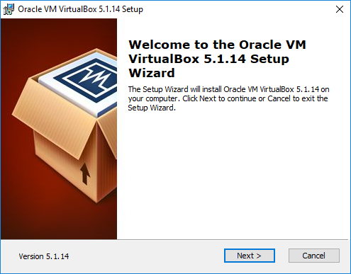
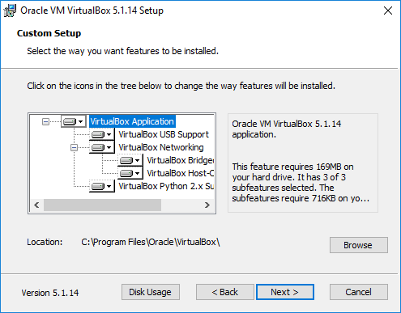
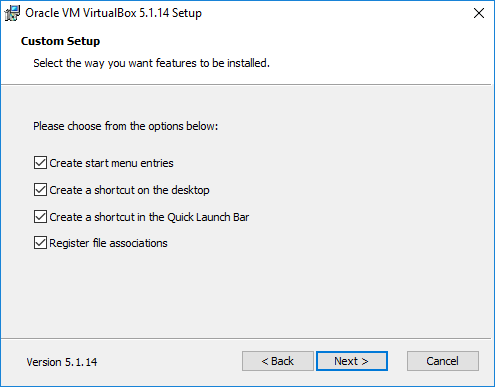
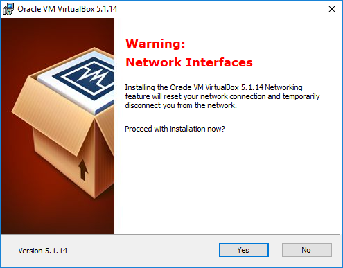
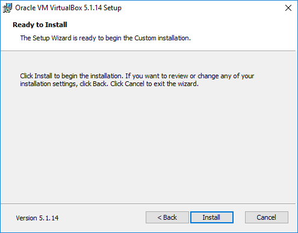
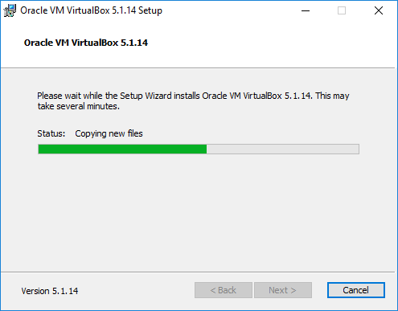
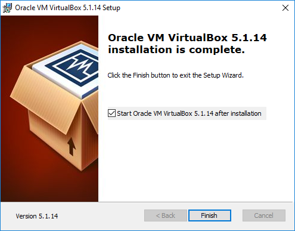
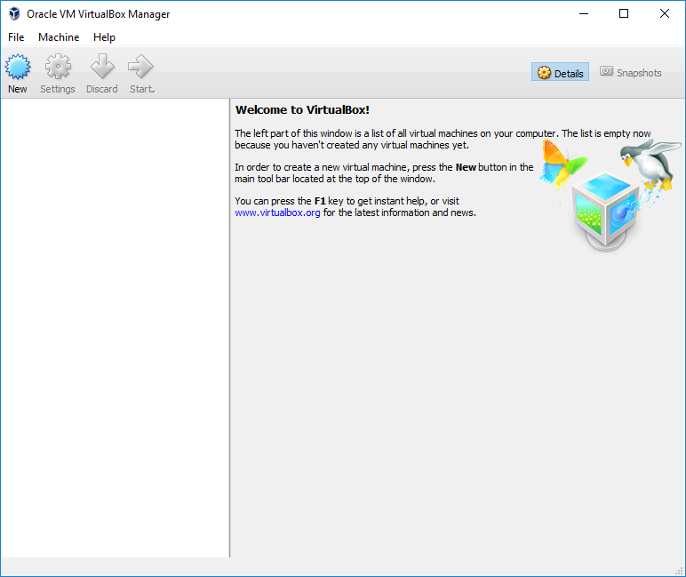

# Oracle VM VirtualBox 5.1.14  
### *An Interactive Installation Guide*

---

## 🚀 Installation Steps

### 1. Welcome Screen
- **Description:**  
  Upon launching the installer, you will be greeted by the Welcome Setup Wizard. Click **"Next"** to proceed with the installation.
  

---

### 2. Custom Setup
- **Description:**  
  On this screen, choose the features to install and modify installation location.  
  Defaults are usually good.  
- **Action:**  
  Click **"Next"** to continue.  

---

### 3. Installation Options
- **Description:**  
  Choose whether to create Start Menu entries, desktop shortcuts, and file associations.  
- **Action:**  
  Make selections, then click **"Next"**.  

---

### 4. Network Warning
- **Description:**  
  You may encounter a network-related warning.  
  Installing the networking feature will temporarily disconnect the system.  
- **Action:**  
  Click **"Yes"** to proceed.  

---

### 5. Ready to Install
- **Description:**  
  Setup is ready to begin. Review your settings.  
- **Action:**  
  Click **"Install"** to continue, or **"Back"** to make changes.  

---

### 6. Installation Progress
- **Description:**  
  Installer will now copy required files. This may take several minutes.  

---

### 7. Installation Complete
- **Description:**  
  You’ll see a confirmation screen once done.  
  Optionally launch VirtualBox now.  
- **Action:**  
  Click **"Finish"** to exit.  

---

### 8. VirtualBox Manager
- **Description:**  
  VirtualBox Manager launches.  
  You can now create and manage virtual machines.  
- **Note:**  
  The list will be empty at first.  

